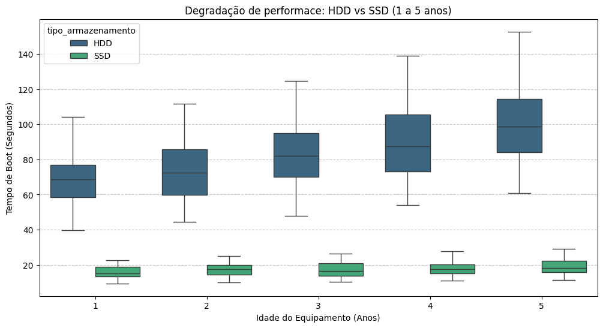
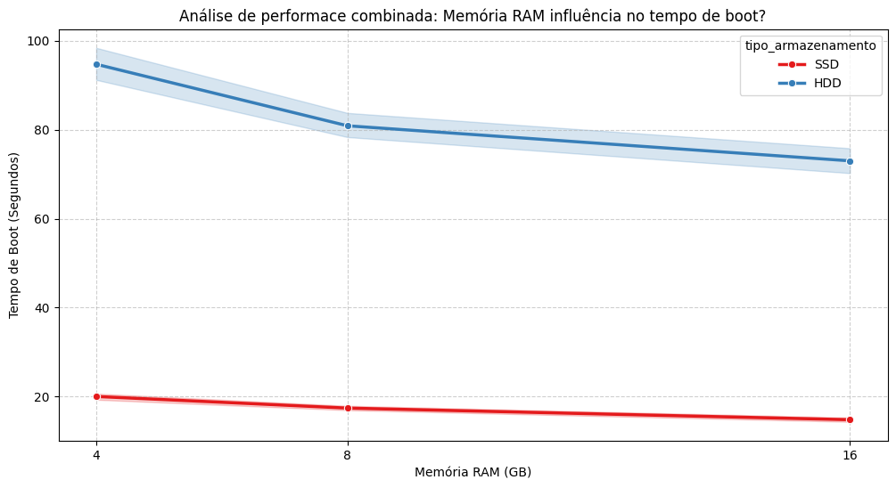

# O impacto de SSD e RAM na performance

## Sobre o projeto
Este projeto simula o ciclo de vida de 1000 notebooks para uma empresa que precisa decidir entre a compra de novas máquinas ou o upgrade das atuais. O objetivo é validar estatisticamente como o tipo de armazenamento e a memória RAM influenciam o tempo de inicialização ao longo dos anos.

## Tecnologias usadas
* **Python 3.13**
* **Pandas:** Para manipular DataFrames e operações por linha.
* **NumPy:** Para a criação de dados sintéticos e distribuições aleatórias.
* **Seaborn e Matplotlib:** Para a visualização de dados e análise exploratória.

## Engenharia de dados e atributos
Para tornar a simulação mais realista possível, apliquei a lógica de crescimento composto para estimar o desgaste no hardware:
* **Degradação exponencial:** Utilizei a fórmula $tempo = base \times (1 + taxa)^{anos}$ para calcular a degradação acumulada. HDDs sofrem uma deterioração de 10% ao ano, enquanto os SSDs deterioram 5% ao ano.
* **Influência da memória RAM:** Máquinas com apenas 4GB de RAM sofrem um acréscimo de 20% no tempo de inicialização, enquanto 16GB oferecem um ganho 10%.

## Principais insights

### 1. Degradação física (HDD vs SSD)

Através do gráfico **Boxplot**, conseguimos verificar que o desgaste no HDD é muito mais sério. Um SSD com 5 anos apresenta uma performance superior a de um HDD novo.

### 2. Combinação da memória RAM

Pelo gráfico **Lineplot**, foi possível notar que a RAM tem uma influência no tempo de boot, que tende a se estabilizar a partir de 16GB. Isso prova que, mesmo que se tenha muita memória RAM, o HDD continua apresentando tempos altos, sendo o SSD a peça central para a performance de boot.

## Conclusão
A recomendação estratégica é priorizar a substituição de HDDs por SSDs. As unidades de armazenamentos são a principal causa do aumento do tempo de boot. O aumento da quantidade de memória RAM sem a troca do HDD pelo SSD não resolve o problema de lentidão das máquinas mais antigas.
